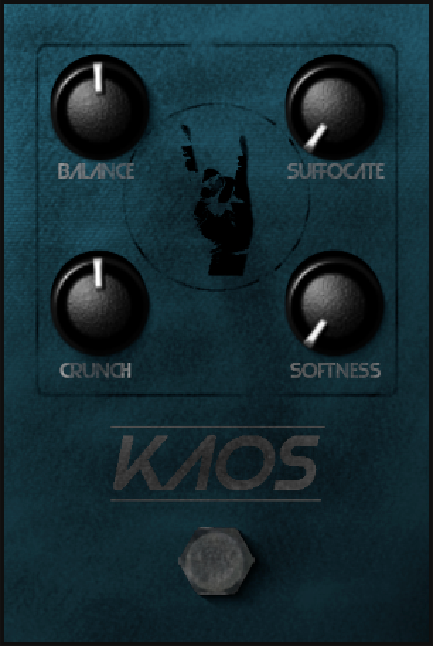

# Kaos Effect Pedal

Kaos is a simple yet robust VST3 effect pedal that mixes an input signal with an adjustable white noise signal to add texture to the sound. The effect pedal features a slider to adjust the input-noise mixing along with 2 distortion effects and an adjustable low-pass filter.

    

## Table of Contents

---
* [What is Kaos?](#what-is-kaos)
    * [Pedal Settings](#pedal-settings)
* [What the GPL License Can Do For You](#what-the-gpl-license-can-do-for-you)
* [Contact Me](#contact-me)

## What is Kaos?

---
[Back to top](#table-of-contents)

As stated earlier, Kaos is a VST3 effect pedal that mixes input signals with a white noise signal and features various distortion effects and a lowpass filter. Below is a summary of its various parameters.

### Pedal Settings
Kaos has 4 different adjustable parameters that impacts the mixing and timbre of the noise it generates. All of these parameters' values range from 0 to 1.

1. **Balance:** This adjusts the mixing of the white noise signal and the input signal. A Balance of 0 results in no noise being mixed in, while a Balance of 1 results in the output consisting entirely of white noise. 
    > Lower Balance values are weighted more than higher Balance values according to a square root curve. This means that, for example, changing the Balance slider from 0.2 to 0.3 results in a greater percentage of additional white noise being mixed in compared to changing the Balance slider from 0.8 to 0.9. 
    >
    > This was done due to the fact that if Balance values are handled linearly (e.g. a slider value of 0.25 indicating an output consisting of 25% white noise), then lower values were difficult to discern and had little difference between them compared to higher values.
2. **Suffocate:** Higher values of Suffocate cause the pedal output to become increasingly muffled. 
    > Behind the scenes, Kaos performs a modified, retro-style phase distortion on the noise signal, with the value of the Suffocation slider equaling the amount of phase distortion applied.
3. **Crunch:** Higher Crunch values result in a harsher white noise generated.
    > The Crunch slider raises the white noise signal generated by the effect pedal to an exponent that directly varies with the slider's value, resulting in a very harsh and sharp distortion effect.
4. **Softness:** The opposite of Crunch, higher values of Softness result in a softer and more muted white noise generated. This does not negate the Crunch value, though, so this parameter can be adjusted in tandem with Crunch to create interesting muted, crackling noise effects.
    > Softness nonlinearly impacts the cutoff frequency of the inbuilt lowpass filter of Kaos's white noise generator. The Softness varies inversely with the cutoff frequency, meaning higher values of softness indicate a lower cutoff frequency.

## What the GPL License Can Do For You

---
[Back to top](#table-of-contents)

Kaos is licensed under the GNU General Public License Version 3 (GPLv3). The full license can be read under the `LICENSE` file bundled with the effect pedal.

In short, the GPLv3 means that by purchasing this product, you don't just gain access to the effect pedal but you also gain access to its underlying code, too. This means that you have free reign over the software, including the right to modify and redistribute the code as you wish (even for a price), so long as your modifications and redistributions are also licensed under the GPLv3.

## Contact Me

---
[Back to top](#table-of-contents)

If you have any suggestions, questions, or issues with the Kaos effect pedal, feel free to contact me at sinistralsynths@gmail.com. I'd also love to see what music and modifications you make with and to my software, so feel free to shoot me an email to show that off as well!